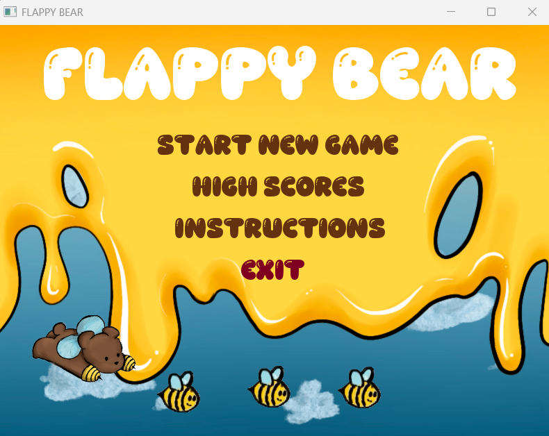

# Flappy Bear

Flappy Bear is a 2D arcade game inspired by Flappy Bird, developed in C++ using SFML.

## Features

- Player controls a flying bear
- Obstacle and coin generation
- Score tracking and HUD
- Menu, instruction, pause and game over screens

## Technologies

- C++17
- SFML
- Visual Studio

## Screenshots

## How to run

1. Clone the repository.
2. Open `simplegame.sln` in Visual Studio.
3. Build the project.
4. Run the game.
